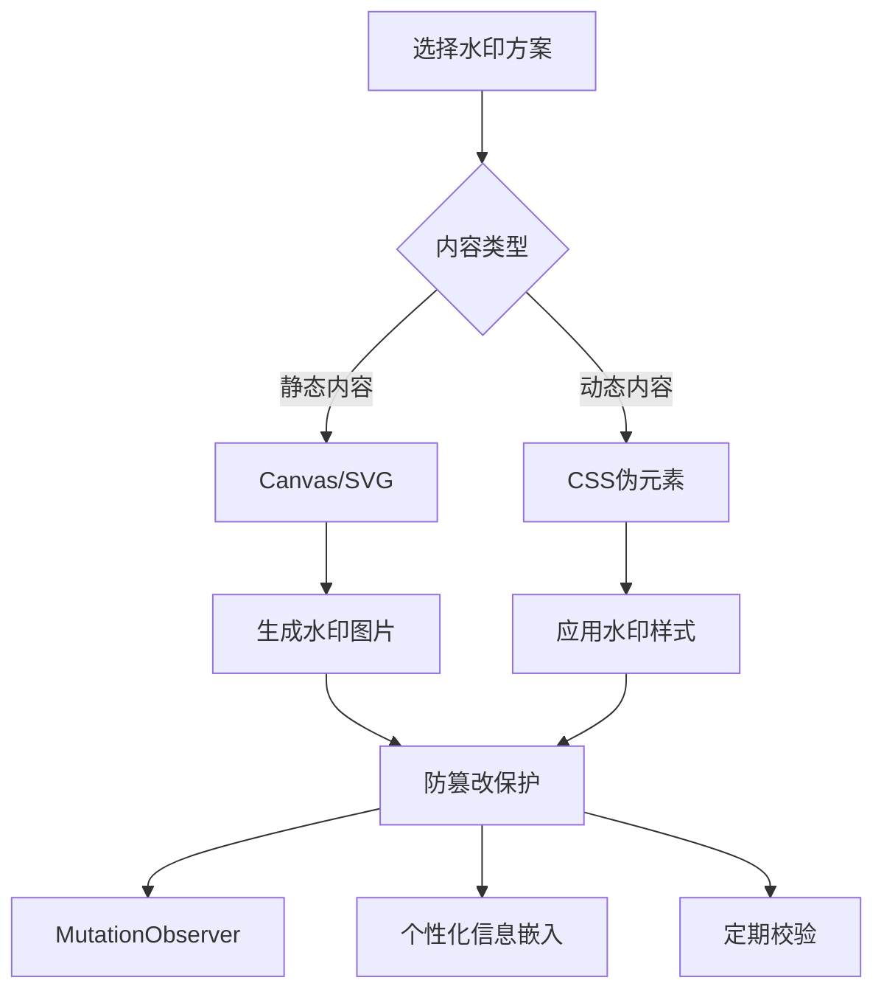

#review 

## 什么是水印？
水印是在网页内容上叠加的半透明标识，用于**版权保护**、**信息溯源**或**防泄密**。常见于文档系统、数据看板等敏感信息展示场景。

## 核心实现方案

### 1. Canvas 动态生成
```javascript
function createWatermark(text) {
  const canvas = document.createElement('canvas');
  canvas.width = 300;
  canvas.height = 200;
  
  const ctx = canvas.getContext('2d');
  ctx.font = '16px Arial';
  ctx.fillStyle = 'rgba(128, 128, 128, 0.2)';
  ctx.rotate(-0.3); // 倾斜角度
  ctx.fillText(text, 50, 100);
  
  return canvas.toDataURL('image/png');
}

// 应用水印
const watermark = document.createElement('div');
watermark.style.backgroundImage = `url(${createWatermark('机密文档')})`;
watermark.style.position = 'fixed';
watermark.style.top = 0;
watermark.style.left = 0;
watermark.style.width = '100%';
watermark.style.height = '100%';
watermark.style.pointerEvents = 'none'; // 关键：穿透点击
document.body.appendChild(watermark);
```

### 2. CSS 伪元素方案
```css
.watermarked {
  position: relative;
}

.watermarked::after {
  content: "内部使用 - 请勿外传";
  position: absolute;
  top: 0;
  left: 0;
  width: 100%;
  height: 100%;
  display: flex;
  justify-content: center;
  align-items: center;
  font-size: 3em;
  color: rgba(0, 0, 0, 0.1);
  transform: rotate(-30deg);
  pointer-events: none;
  z-index: 9999;
}
```

### 3. SVG 背景方案
```html
<div style="
  background-image: url('data:image/svg+xml;utf8,<svg ...>');
  background-repeat: repeat;
">
  <!-- 页面内容 -->
</div>
```

## 防篡改策略

| 策略 | 实现方式 | 有效性 |
|------|---------|--------|
| DOM监控 | MutationObserver 监听水印元素变化 | ★★★★☆ |
| 样式保护 | 禁用开发者工具（不推荐） | ★☆☆☆☆ |
| 服务端渲染 | 将水印直接嵌入到图片/PDF中 | ★★★★★ |
| 动态水印 | 包含用户ID等个性化信息 | ★★★★☆ |

```javascript
// MutationObserver 保护示例
const observer = new MutationObserver(mutations => {
  mutations.forEach(mutation => {
    if (!document.contains(watermark)) {
      document.body.appendChild(watermark);
    }
  });
});

observer.observe(document.body, {
  childList: true,
  subtree: true
});
```

## 最佳实践
1. **视觉平衡**：透明度建议在 0.05-0.2 之间
2. **性能优化**：对动态内容使用 CSS 方案，静态内容用 Canvas
3. **响应式设计**：使用 `background-size` 控制水印密度
4. **信息设计**：
   - 包含时间戳：`2023-08-15`
   - 用户标识：`user:zhangsan`
   - 系统标识：`SYS:HR-DASHBOARD`

## 浏览器兼容性
- Canvas：所有现代浏览器（IE9+）
- SVG：IE9+（部分属性需polyfill）
- CSS伪元素：IE8+

> **注意**：前端水印不能替代后端安全措施，敏感数据应结合服务端水印方案

## 相关资源
- [[前端安全最佳实践]]
- [[Canvas API 使用指南]]
- [[CSS 伪元素高级用法]]

---

