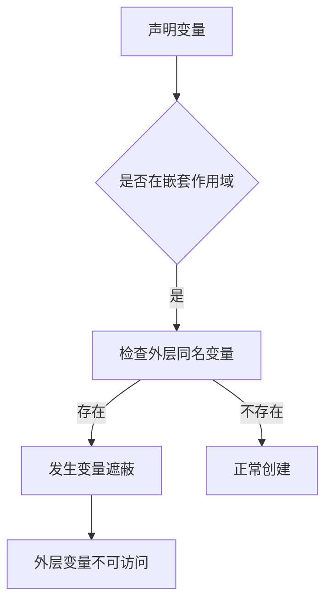

#review 

## 定义
**变量遮蔽**指在嵌套作用域中，内层作用域声明的变量覆盖了外层同名变量的现象，导致外层变量无法被直接访问。


## 发生场景
### 1. 块级作用域遮蔽
```javascript
let x = 10; // 外层变量

{
  let x = 20; // 遮蔽外层x
  console.log(x); // 20
}

console.log(x); // 10
```

### 2. 函数参数遮蔽
```javascript
function process(data) {
  let data = "modified"; // ❌ 遮蔽参数
  console.log(data);
}
process("original"); // "modified"
```

### 3. 类继承遮蔽
```typescript
class Animal {
  name = "Animal";
}

class Dog extends Animal {
  name = "Dog"; // 遮蔽父类属性
  
  showName() {
    console.log(this.name); // "Dog"
    console.log(super.name); // "Animal"
  }
}
```

## 遮蔽 vs 覆盖

| 特性       | 变量遮蔽                  | 方法覆盖                    |
|------------|--------------------------|---------------------------|
| **作用对象** | 变量                     | 方法                      |
| **作用域**  | 静态作用域               | 动态作用域（继承链）      |
| **访问方式**| 无法直接访问被遮蔽变量   | 可通过`super`访问父类方法 |
| **典型场景**| `let/const`块级作用域    | 类继承                    |

## 危害与解决方案

### 常见问题
1. **意外数据修改**：遮蔽导致操作错误变量
2. **调试困难**：难以追踪变量值变化
3. **内存泄漏**：意外保留不需要的引用

### 最佳实践
```javascript
// 避免方案1：使用不同命名
function calculate(total) {
  const itemTotal = total * 1.1; // 避免遮蔽参数
  
  return itemTotal;
}

// 避免方案2：IIFE隔离作用域
let count = 0;
(function() {
  let internalCount = 1; // 独立作用域
  // ...
})();

// 避免方案3：明确访问路径
class User {
  username = "admin";
  
  update(username) {
    this.username = username; // 明确指定this
  }
}
```

## 语言特性对比

| 语言       | 遮蔽支持          | 防止遮蔽机制               |
|------------|------------------|--------------------------|
| JavaScript | ✅ `let/const`   | 严格模式禁止重复声明      |
| Python     | ✅ 函数/局部作用域 | `nonlocal`关键字         |
| Java       | ✅ 块级作用域     | IDE警告/编译检查         |
| C++        | ✅ 嵌套作用域     | `::`全局作用域操作符     |

## 调试技巧
1. 使用**断点调试**检查作用域链
2. 开启ESLint规则：
   ```json
   "rules": {
     "no-shadow": "error",
     "no-param-reassign": "warn"
   }
   ```
3. 利用Chrome DevTools的**Scope面板**查看变量绑定

> **注意**：合理使用遮蔽可以实现**命名空间隔离**，但多数情况下应避免无意识的遮蔽

## 相关概念
- [[../../JavaScript/面试/作用域与闭包]]
- [[JavaScript 执行上下文]]
- [[面向对象编程原则]]
- [[ESLint 配置指南]]

