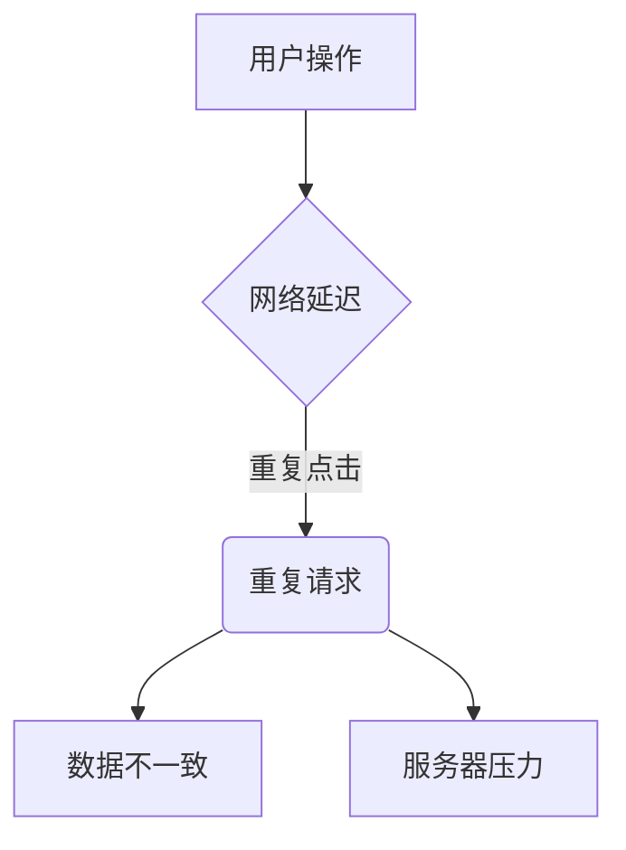
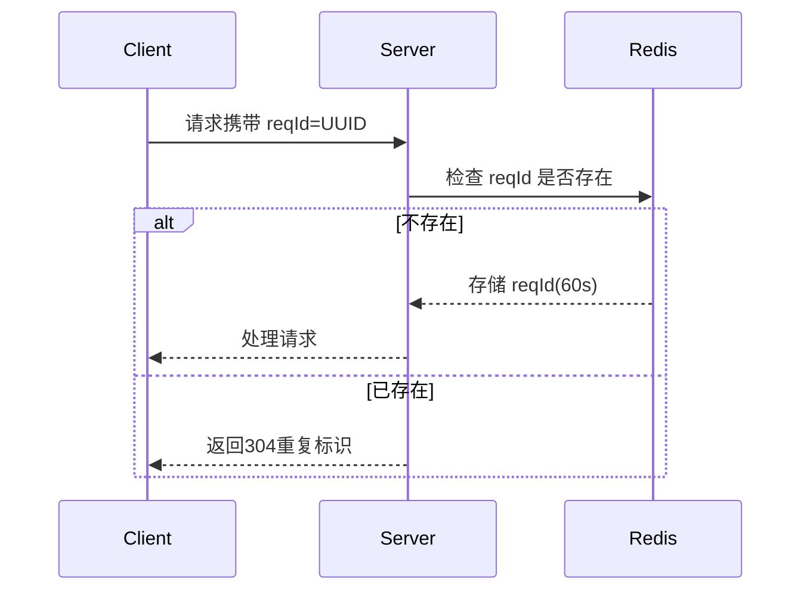

#### **核心问题分析**


#### **解决方案体系**
| 方案类型          | 适用场景                | 实现复杂度 | 可靠性 |
|-------------------|-----------------------|------------|--------|
| UI层拦截          | 用户高频操作           | ★☆☆        | ★★☆    |
| 请求锁            | 关键业务操作           | ★★☆        | ★★★    |
| 请求取消          | 长请求/页面跳转        | ★★☆        | ★★★    |
| 响应缓存          | 幂等GET请求            | ★☆☆        | ★★☆    |
| 唯一请求ID         | 分布式系统             | ★★★        | ★★★★  |

---

#### **1. UI层防抖/节流（Vue实现）**
```vue:ButtonDebounce.vue
<template>
  <button @click="handleClick">提交</button>
</template>

<script setup>
import { ref } from 'vue'

// 防抖（最后一次操作后等待）
const debounce = (fn, delay = 1000) => {
  let timer = null
  return (...args) => {
    clearTimeout(timer)
    timer = setTimeout(() => fn(...args), delay)
  }
}

// 节流（固定间隔执行）
const throttle = (fn, interval = 1000) => {
  let last = 0
  return (...args) => {
    const now = Date.now()
    if (now - last > interval) {
      fn(...args)
      last = now
    }
  }
}

const submitAPI = () => { /* 请求逻辑 */ }
const handleClick = debounce(submitAPI, 800) // 800ms内仅执行一次
</script>
```
**适用场景**：表单提交按钮、搜索框输入

---

#### **2. 请求锁机制（Axios拦截器）**
```js:requestLock.js
const pendingMap = new Map()

axios.interceptors.request.use(config => {
  const requestKey = `${config.method}-${config.url}`
  
  if (pendingMap.has(requestKey)) {
    return Promise.reject(new Error('重复请求已阻止'))
  }
  
  pendingMap.set(requestKey, true)
  return config
})

axios.interceptors.response.use(response => {
  const requestKey = `${response.config.method}-${response.config.url}`
  pendingMap.delete(requestKey)
  return response
}, error => {
  // 错误时清除锁
  const config = error.config
  if (config) {
    const requestKey = `${config.method}-${config.url}`
    pendingMap.delete(requestKey)
  }
  return Promise.reject(error)
})
```
**优势**：  
- 全请求链路控制  
- 支持不同HTTP方法区分 (GET/POST)

---

#### **3. AbortController取消请求**
```vue:AbortController.vue
<script setup>
import { ref, onUnmounted } from 'vue'

const controller = ref(null)

const fetchData = async () => {
  // 取消前一个请求
  if (controller.value) {
    controller.value.abort() 
  }
  
  controller.value = new AbortController()
  
  try {
    const res = await fetch('/api/data', {
      signal: controller.value.signal
    })
    // 处理响应
  } catch (err) {
    if (err.name !== 'AbortError') {
      console.error('请求错误', err)
    }
  }
}

onUnmounted(() => {
  controller.value?.abort()
})
</script>
```
**最佳实践**：  
- 页面跳转时取消未完成请求  
- 组件卸载时自动清理  

---

#### **4. 响应缓存策略**
```js:requestCache.js
const cache = new Map()

async function cachedRequest(url) {
  if (cache.has(url)) {
    return cache.get(url)
  }
  
  const response = await fetch(url)
  const data = await response.json()
  
  // 设置10秒缓存
  cache.set(url, data)
  setTimeout(() => cache.delete(url), 10000)
  
  return data
}
```

---

#### **分布式系统解决方案：唯一请求ID**


---

#### **完整实现：Vue + Axios复合方案**
```js:requestUtils.js
import axios from 'axios'

const requestPool = new Map()
const CACHE_TIME = 5 * 1000 // 5秒缓存

// 生成请求指纹
const genReqKey = (config) => [
  config.method,
  config.url,
  JSON.stringify(config.params),
  JSON.stringify(config.data)
].join('&')

// 请求拦截
axios.interceptors.request.use(config => {
  const key = genReqKey(config)
  
  // 请求锁检查
  if (requestPool.has(key)) {
    return Promise.reject({ 
      message: '重复请求', 
      config,
      isRepeat: true 
    })
  }
  
  // 缓存检查
  if (config.cacheable && requestPool.get(key)?.cache) {
    return Promise.resolve(requestPool.get(key).cache)
  }
  
  requestPool.set(key, { 
    timestamp: Date.now(),
    controller: new AbortController(),
    cache: null
  })
  
  config.signal = requestPool.get(key).controller.signal
  return config
})

// 响应拦截
axios.interceptors.response.use(response => {
  const key = genReqKey(response.config)
  const record = requestPool.get(key)
  
  if (response.config.cacheable) {
    record.cache = response.data
    setTimeout(() => requestPool.delete(key), CACHE_TIME)
  } else {
    requestPool.delete(key)
  }
  
  return response
}, error => {
  if (!error.isRepeat) {
    const key = genReqKey(error.config)
    requestPool.delete(key)
  }
  return Promise.reject(error)
})
```

---

#### **防御矩阵参考表**
| 攻击类型         | 防御方案               | 实现位置     |
|------------------|----------------------|------------|
| 用户重复点击     | UI防抖+请求锁         | 前端       |
| 网络自动重试     | 请求ID+幂等设计       | 后端       |
| 浏览器刷新       | 响应缓存              | 前端       |
| 恶意脚本攻击     | 验证码+限流           | 网关       |

> **最佳实践总结**  
> 1. 基础场景：按钮防抖 + 请求锁  
> 2. 关键业务：AbortController + 唯一请求ID  
> 3. 性能敏感：响应缓存 + 本地存储  
> 4. 监控必备：[[前端异常监控系统]]中记录重复请求事件  

**扩展阅读**  
1. [[HTTP幂等性设计]]  
2. [[Axios高级封装模式]]  
3. [[分布式请求去重策略]]