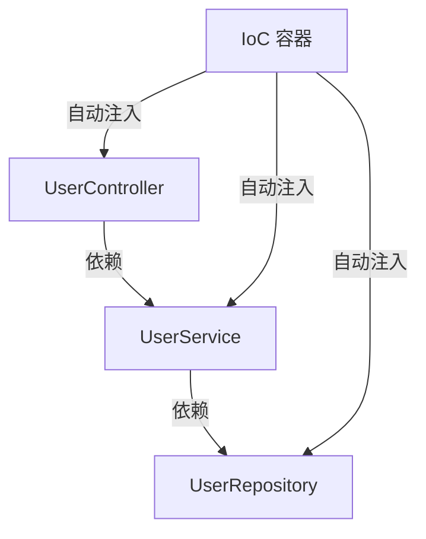

## **1. IoC（Inversion of Control，控制反转）**
### **(1) 定义**
IoC 是一种 **设计原则**，指将 **对象的创建和管理权** 从程序员手中交给 **框架/容器** 来控制，从而实现 **解耦**。

### **(2) 传统方式 vs IoC 方式**
| 方式 | 控制权 | 代码耦合度 | 示例 |
|------|------|------|------|
| **传统方式** | 程序员手动 `new` 对象 | 高耦合 | `const userService = new UserService();` |
| **IoC 方式** | 容器自动管理对象 | 低耦合 | `@Injectable() class UserService {}`（由 NestJS 管理） |

### **(3) IoC 的优势**
- **解耦**：对象之间不直接依赖，而是依赖抽象（接口/基类）。
- **可测试性**：方便 Mock 依赖项。
- **可维护性**：修改依赖时不影响调用方。

---

## **2. DI（Dependency Injection，依赖注入）**
### **(1) 定义**
DI 是 **IoC 的一种实现方式**，指 **由外部（通常是框架）提供依赖对象**，而不是在类内部创建。

### **(2) 依赖注入的三种方式**
| 方式 | 说明 | 示例 |
|------|------|------|
| **构造函数注入** | 通过构造函数传入依赖 | `constructor(private userService: UserService) {}` |
| **属性注入** | 通过 `@Inject()` 直接注入属性 | `@Inject() private userService: UserService;` |
| **方法注入** | 通过方法参数注入 | `someMethod(@Inject() userService: UserService) {}` |

**NestJS 默认使用构造函数注入**，例如：
```typescript
@Injectable()
export class UserService {
  getUsers() { return ['Alice', 'Bob']; }
}

@Controller('users')
export class UserController {
  constructor(private userService: UserService) {} // 依赖注入
  @Get()
  getUsers() {
    return this.userService.getUsers();
  }
}
```

### **(3) DI 的优势**
- **减少硬编码**：避免在类内部 `new` 依赖对象。
- **便于替换**：可轻松替换实现（如测试时替换为 Mock）。
- **生命周期管理**：框架可以管理单例、请求级实例等。

---

## **3. IoC 容器（NestJS 的依赖注入系统）**
NestJS 内置 **IoC 容器**，负责：
1. **自动扫描 `@Injectable()` 类**（如 `Service`、`Repository`）。
2. **管理依赖关系**（如 `Controller` 依赖 `Service`）。
3. **控制对象生命周期**（如单例、请求级实例）。

**示例：NestJS 的 IoC 容器工作流程**


---

## **4. 总结**
| 概念 | 定义 | 作用 | 在 NestJS 中的应用 |
|------|------|------|------|
| **IoC（控制反转）** | 将对象创建权交给容器 | 解耦、提高可维护性 | 由 NestJS IoC 容器管理依赖 |
| **DI（依赖注入）** | 由外部提供依赖对象 | 减少硬编码、便于测试 | `@Injectable()` + 构造函数注入 |
| **IoC 容器** | 管理依赖关系的框架组件 | 自动创建和注入对象 | NestJS 内置依赖注入系统 |

**关键点：**
- **IoC 是设计思想**，DI 是它的实现方式。
- **NestJS 通过 `@Injectable()` 和构造函数注入** 实现 DI。
- **IoC 容器自动管理依赖**，开发者只需声明依赖关系。

通过 IoC 和 DI，NestJS 让代码更 **模块化、可测试、易维护**。 🚀