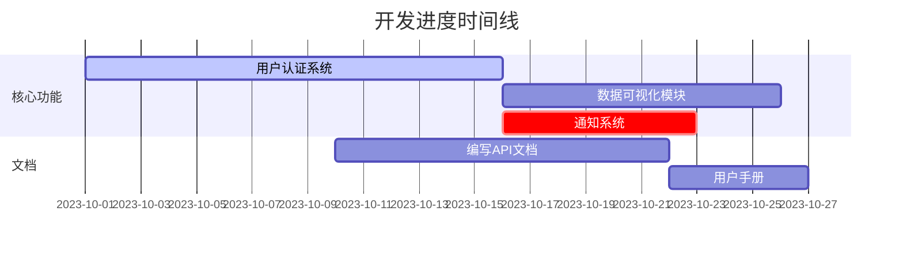

## 🚧 项目待办事项

### 📋 任务清单

#### 高优先级 (🔥)
- [ ] 实现JWT认证机制 `[前端]` `[后端]` ⏰ 2023-10-15
- [ ] 设计数据库迁移脚本 `[数据库]` ⚠️ 阻塞通知系统开发
- [ ] 完成支付集成 `[财务]` `[关键路径]`

#### 进行中 (🛠️)
- [x] 项目初始化搭建 `[架构]` ✅ 2023-10-05
- [ ] 响应式布局优化 `[前端]` █████░░░ 70%
- [ ] 单元测试覆盖率提升 `[测试]` ██░░░░░░ 20%

#### 低优先级 (⏳)
- [ ] 多语言支持 `[i18n]`
- [ ] 性能监控集成 `[DevOps]`
- [ ] 暗黑模式切换 `[UI]`

### 📊 进度统计
| 类别       | 总数 | 完成 | 进度   |
|------------|------|------|--------|
| **前端**   | 8    | 3    | 37.5%  |
| **后端**   | 12   | 5    | 41.7%  |
| **测试**   | 5    | 1    | 20%    |
| **文档**   | 3    | 0    | 0%     |
| **总计**   | 28   | 9    | 32.1%  |

📌 **今日焦点任务**: 
- 修复用户注册表单验证漏洞
- 部署预览环境v1.2.0