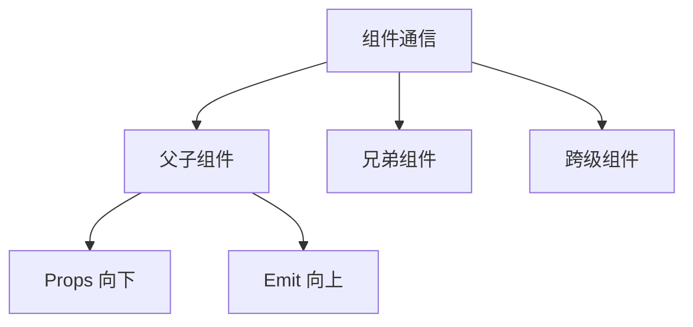

# Vue 组件通信：`emit` 的深度解析与应用指南



## 一、什么是 `emit`？

`emit` 是 Vue 组件通信的核心机制之一，主要处理**子组件向父组件**的数据传递。它实现了：
- **自定义事件系统**：不同于原生 DOM 事件
- **单向数据流**：子 → 父的通信方式
- **解耦设计**：避免组件间直接依赖

## 二、基础用法

### 1. 子组件触发事件
```vue
<!-- ChildComponent.vue -->
<script setup>
const emit = defineEmits(['submit'])

const handleClick = () => {
  emit('submit', { 
    id: 123, 
    data: 'payload' 
  })
}
</script>

<template>
  <button @click="handleClick">提交</button>
</template>
```

### 2. 父组件监听事件
```vue
<!-- ParentComponent.vue -->
<template>
  <ChildComponent 
    @submit="handleSubmit" 
  />
</template>

<script setup>
const handleSubmit = (payload) => {
  console.log('收到数据:', payload)
  // { id: 123, data: 'payload' }
}
</script>
```

## 三、高级用法

### 1. 事件验证 (TypeScript)
```ts
const emit = defineEmits({
  // 验证函数
  submit: (payload: { id: number; data: string }) => {
    // 返回布尔值表示验证结果
    return typeof payload.id === 'number' && 
           payload.data.length > 0
  }
})
```

### 2. 多参数传递
```vue
<script setup>
const emit = defineEmits(['update'])

// 传递多个参数
const updateValue = () => {
  emit('update', 'newValue', 123, true)
}
</script>
```

### 3. 动态事件名
```js
const eventName = computed(() => `update:${propName}`)
emit(eventName.value, newValue)
```

## 四、最佳实践

### 1. 命名规范
```markdown
- 使用 **kebab-case**：`update-value`
- 避免原生事件名：不用 `click`, `change` 等
- 语义化命名：`form-submitted`, `user-selected`
```

### 2. 与 `v-model` 集成
```vue
<!-- 自定义输入组件 -->
<script setup>
defineProps(['modelValue'])
defineEmits(['update:modelValue'])

const update = (e) => {
  emit('update:modelValue', e.target.value)
}
</script>

<template>
  <input 
    :value="modelValue"
    @input="update"
  />
</template>
```

### 3. 事件总线模式 (小型项目)
```js
// eventBus.js
import mitt from 'mitt'
export default mitt()

// ComponentA
eventBus.emit('global-event', data)

// ComponentB
eventBus.on('global-event', handler)
```

## 五、常见场景示例

### 1. 表单提交
```vue
<!-- FormComponent.vue -->
<script setup>
const emit = defineEmits(['submit-form'])

const submit = () => {
  if (validateForm()) {
    emit('submit-form', formData)
  }
}
</script>
```

### 2. 模态框控制
```vue
<!-- Modal.vue -->
<template>
  <div v-show="isOpen">
    <button @click="close">关闭</button>
  </div>
</template>

<script setup>
defineProps(['isOpen'])
const emit = defineEmits(['close'])

const close = () => emit('close')
</script>
```

### 3. 数据双向绑定
```vue
<!-- CustomCheckbox.vue -->
<script setup>
defineProps(['modelValue'])
defineEmits(['update:modelValue'])

const toggle = () => {
  emit('update:modelValue', !modelValue)
}
</script>
```

## 六、性能优化与陷阱

### 1. 问题排查表
| 问题现象 | 可能原因 | 解决方案 |
|---------|---------|---------|
| 事件未触发 | 事件名大小写不匹配 | 统一使用kebab-case |
| 参数undefined | 未正确传递参数 | 检查emit调用参数 |
| 多次触发 | 未移除事件监听 | 在unmounted中移除监听 |

### 2. 内存优化
```js
// 组件卸载时移除监听
onUnmounted(() => {
  eventBus.off('event-name', handler)
})
```

## 七、完整代码示例

```vue
<!-- ParentComponent.vue -->
<template>
  <div>
    <ChildComponent 
      @value-updated="handleUpdate"
      @form-submitted="submitForm"
    />
    
    <p>当前值: {{ currentValue }}</p>
  </div>
</template>

<script setup>
import { ref } from 'vue'
import ChildComponent from './ChildComponent.vue'

const currentValue = ref(0)

const handleUpdate = (newValue) => {
  currentValue.value = newValue
}

const submitForm = (formData) => {
  console.log('表单数据:', formData)
}
</script>
```

```vue
<!-- ChildComponent.vue -->
<template>
  <div>
    <button @click="increment">增加</button>
    <button @click="submit">提交</button>
  </div>
</template>

<script setup>
import { defineEmits } from 'vue'

const emit = defineEmits({
  'value-updated': (value) => value >= 0,
  'form-submitted': null // 无需验证
})

let count = 0

const increment = () => {
  count++
  emit('value-updated', count)
}

const submit = () => {
  emit('form-submitted', {
    id: Date.now(),
    count
  })
}
</script>
```

## 总结

`emit` 是 Vue 组件通信的支柱功能：
- ✅ **单向数据流**：维护清晰的数据流向
- 🔧 **灵活扩展**：支持类型验证、动态事件等
- ⚡ **高性能**：原生事件系统集成
- 🧩 **生态兼容**：完美支持 Vue3 组合式 API

> **最佳实践原则**：  
> "Props down, events up" - 始终让数据通过 props 向下流动，  
> 通过 emit 事件向上传递状态变更。


---
**相关链接**
 1. [emit](../面试/emit.md) 
 2. [Vue 多 v-model 通信机制](../面试/Vue%20多%20v-model%20通信机制.md)