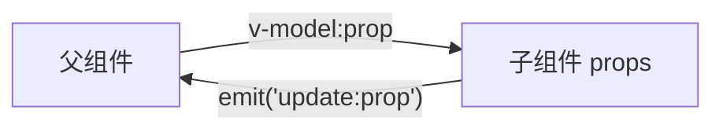

#review 

以下是一篇关于 Vue 中 `v-model` 向子组件传递多个值及子组件修改值的学习笔记，结合 Vue 3 的 Composition API 和 Options API 两种实现方式：

---
### [[Vue 多 v-model 通信机制]]
#### **核心概念**
```markdown
1. `v-model` 本质：语法糖，等价于 `:modelValue` + `@update:modelValue`
2. 多值传递：Vue 3 支持**多个 `v-model` 绑定**，如 `v-model:propA`、`v-model:propB`
3. 数据流：父组件 → 通过 `v-model` 传递 → 子组件 → 通过 `emit` 修改
```

#### **实现方案**
##### 父组件 (Parent.vue)
```vue
<template>
  <!-- 传递多个 v-model -->
  <ChildComponent 
    v-model:username="userData.name"
    v-model:age="userData.age"
  />
</template>

<script setup>
// Composition API
import { reactive } from 'vue'
const userData = reactive({ name: 'Alice', age: 25 })
</script>
```

##### 子组件 (ChildComponent.vue) - Composition API
```vue
<template>
  <input 
    :value="username" 
    @input="update('username', $event.target.value)"
  />
  <input 
    type="number" 
    :value="age" 
    @input="update('age', Number($event.target.value))"
  />
</template>

<script setup>
const props = defineProps(['username', 'age'])
const emit = defineEmits(['update:username', 'update:age'])

const update = (prop, value) => {
  emit(`update:${prop}`, value) // 关键修改逻辑
}
</script>
```

##### 子组件 - Options API
```vue
<script>
export default {
  props: ['username', 'age'],
  emits: ['update:username', 'update:age'],
  methods: {
    updateField(prop, value) {
      this.$emit(`update:${prop}`, value)
    }
  }
}
</script>
```

#### **关键机制解析**


1. **多绑定原理**：
   - `v-model:username` → 编译为 `:username` + `@update:username`
   - 每个绑定独立维护数据流

2. **修改限制**：
   - 子组件**禁止**直接修改 props (`props.username = 'new'` ❌)
   - 必须通过 `emit('update:prop')` 触发父组件变更 (✅)

3. **类型安全**：
   ```ts
   // TypeScript 类型声明
   defineProps<{ 
     username: string, 
     age: number 
   }>()
   
   defineEmits<{
     (e: 'update:username', value: string): void
     (e: 'update:age', value: number): void
   }>()
   ```

#### **应用场景**
1. 表单组件组（用户信息/地址表单）
2. 配置面板（多参数实时联动）
3. 状态管理替代方案（简单场景替代 Pinia）

#### **最佳实践**
1. **命名规范**：
   - 使用语义化 prop 名（`v-model:searchText` 优于 `v-model:text1`）
   - emit 事件名保持 `update:<prop>` 格式

2. **复杂对象处理**：
   ```vue
   <!-- 传递整个对象 -->
   <Child v-model:config="settings" />
   
   <!-- 子组件内 -->
   emit('update:config', { ...props.config, key: newValue })
   ```

3. **验证机制**：
   ```js
   update(prop, value) {
     if (prop === 'age' && value < 0) return // 拦截非法值
     emit(`update:${prop}`, value)
   }
   ```

> **扩展阅读**  
> 1. [[Vue 响应式原理]]  
> 2. [[组件通信模式对比]]  
> 3. [[v-model 与 .sync 历史演进]]

---
### 实操建议
```markdown
1. 在 [[Vue Playground项目]] 中创建 `MultiVModelDemo.vue` 实操
2. 调试工具：使用 Vue Devtools 观察 props/emit 事件流
3. 边界测试：验证空值/类型错误时的防御机制
```

此模式在 [[Element Plus 表单组件]] 中广泛应用，推荐结合源码学习实现细节。