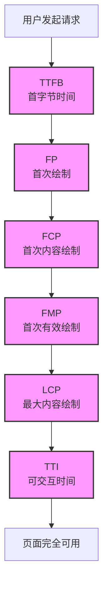

## 一、为什么需要关注性能指标

在面试中描述性能优化成果时，**避免直接说**：*"页面从5秒加载优化到3秒"*。这种说法不够严谨，因为：

1. 未明确具体的性能指标
2. 没有区分不同阶段的加载过程
3. 无法准确反映用户体验提升
4. 缺乏专业性和说服力

**正确做法**：基于**标准化性能指标**进行量化对比

## 二、首屏加载核心性能指标详解

### 1. 绘制相关指标（渲染阶段）

| 指标 | 全称 | 定义 | 意义 | 优化方向 |
|------|------|------|------|---------|
| **FP** | First Paint<br>首次绘制 | 页面首次呈现任何元素的时间 | 反映浏览器开始渲染 | 减少HTML文档大小；优化服务器响应 |
| **FCP** | First Contentful Paint<br>首次内容绘制 | 页面渲染出**任何文本/图像/CSS内容**的时间 | **核心指标**，反映用户感知加载时间 | JS执行优化；关键资源优化；资源预加载 |
| **FMP** | First Meaningful Paint<br>首次有效绘制 | **主要内容**(如核心数据)呈现在屏幕上的时间 | 衡量用户真正关注的内容何时可用 | 接口性能优化；关键数据预取 |
| **LCP** | Largest Contentful Paint<br>最大内容绘制 | 视窗内最大内容元素渲染完成的时间 | 反映页面主要内容加载体验 | 图片/视频优化；布局稳定性优化 |

> **FP到FCP时间差**：反映SPA应用JS执行时间，时间过长会导致**白屏问题**

### 2. 交互性与阻塞相关指标

| 指标 | 全称 | 定义 | 意义 | 优化方向 |
|------|------|------|------|---------|
| **TTI** | Time To Interactive<br>可交互时间 | 页面完全可响应交互的时间点 | 衡量用户何时可操作界面 | JS代码拆分；延迟加载非关键脚本 |
| **TBT** | Total Blocking Time<br>总阻塞时间 | FP到TTI之间的阻塞时间 | 反映用户等待交互的时长 | 长任务拆分；主线程优化 |
| **INP** | Interaction to Next Paint<br>交互到下次绘制时间 | 用户操作到页面响应更新的时间 | 衡量交互流畅度 | JS执行优化；异步处理任务 |

> **SSR场景注意**：即使HTML快速渲染(TTFB快)，也需要等待JS加载完成才能获得TTI

### 3. 布局稳定性与资源请求指标

| 指标 | 全称 | 定义 | 意义 | 优化方向 |
|------|------|------|------|---------|
| **CLS** | Cumulative Layout Shift<br>累积布局偏移 | 页面生命周期内意外布局位移总和 | 衡量视觉稳定性 | 预置尺寸；避免异步插入内容；字体加载优化 |
| **TTFB** | Time To First Byte<br>首字节时间 | 请求发出到收到首字节的时间 | **网络指标**，反映后端/CDN响应速度 | CDN优化；服务器缓存；减少重定向 |

## 三、面试满分回答框架

### 1. 分析优化前问题

```markdown
在优化前，我们应用存在以下性能问题：
- **FCP时间过长**（>4s），用户感知首次内容加载缓慢
- **FCP到TTI时间差大**（约2.5s），导致用户长时间无法交互
- **LCP指标不稳定**（最大内容块加载时间在3-6s波动）
```

### 2. 具体优化措施与指标对比

```javascript
// 优化措施示例
const optimizations = {
  resourceLoading: "图片懒加载 + HTTP/2推送 + 资源预加载",
  jsExecution: "代码分割(code-splitting) + Preact替代React",
  ssrOptimization: "流式SSR(Streaming SSR) + 部分注水",
  cachingStrategy: "Service Worker缓存关键资源 + CDN边缘缓存"
};

// 指标对比
const metricsComparison = [
  { metric: "FCP", before: "4200ms", after: "1200ms", decrease: "71%" },
  { metric: "LCP", before: "6200ms", after: "1800ms", decrease: "71%" },
  { metric: "TTI", before: "6800ms", after: "2300ms", decrease: "66%" },
  { metric: "INP", before: "320ms", after: "125ms", decrease: "61%" },
  { metric: "CLS", before: "0.35", after: "0.05", decrease: "86%" }
];
```

### 3. 性能监测与验证方法

```markdown
我们使用以下方式验证优化效果：
1. Lighthouse综合测评（生产环境定期运行）
2. RUM（真实用户监控）数据收集
3. Web Vitals仪表板持续监测
4. Chrome DevTools Performance分析关键瓶颈
```

## 四、性能优化整体策略示意图



## 五、重要技术总结

1. **核心优化原则**：减少资源体积 + 缩短关键路径

2. **关键技术点**：
   - 代码拆分(Code Splitting) → 减小初始JS体积
   - Tree Shaking → 移除未使用代码
   - 图片优化（WebP, AVIF, 懒加载）
   - HTTP/2服务器推送
   - 预加载关键资源(preload, prefetch)
   - 服务端渲染(SSR) + 渐进式注水(hydration)
   - Web Workers处理长任务

3. **避免常见错误**：
   - 未区分移动/桌面性能指标
   - 忽略真实用户监控(RUM)数据
   - 过度优化次要指标忽视核心体验
   - 未进行持续的回归测试

## 六、面试应答模板

```markdown
**面试官问**：请描述你负责的性能优化项目及成果

**满分回答**：
在某电商项目中，我们识别到**关键问题**：
1. FCP超过4秒，首次内容渲染慢
2. LCP指标波动大（3-6秒）
3. TTI时间长（>6.5秒），影响转化率

我们实施的**优化方案**包括：
1. 采用流式SSR减少FCP时间
2. 实现基于路由的代码分割
3. 关键JS预加载+非关键脚本延迟
4. 图片全面转为WebP格式+CDN优化

**量化成果**：
- FCP: 4200ms → 1200ms (-71%) 
- LCP: 6200ms → 1800ms (-71%）
- TTI: 6800ms → 2300ms (-66%)
- 转化率提升17%

监控工具包括Lighthouse和Web Vitals仪表盘，**后续计划**是进一步优化INP指标和Core Web Vitals合格率
```

> **最终关键点**：在面试中谈论性能优化时，必须使用**确切的指标名称+具体数值变化**来展示专业性