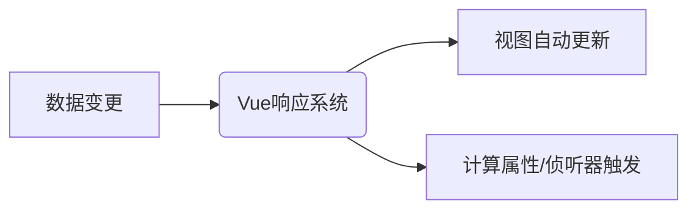
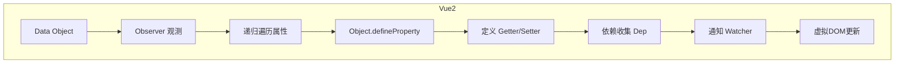
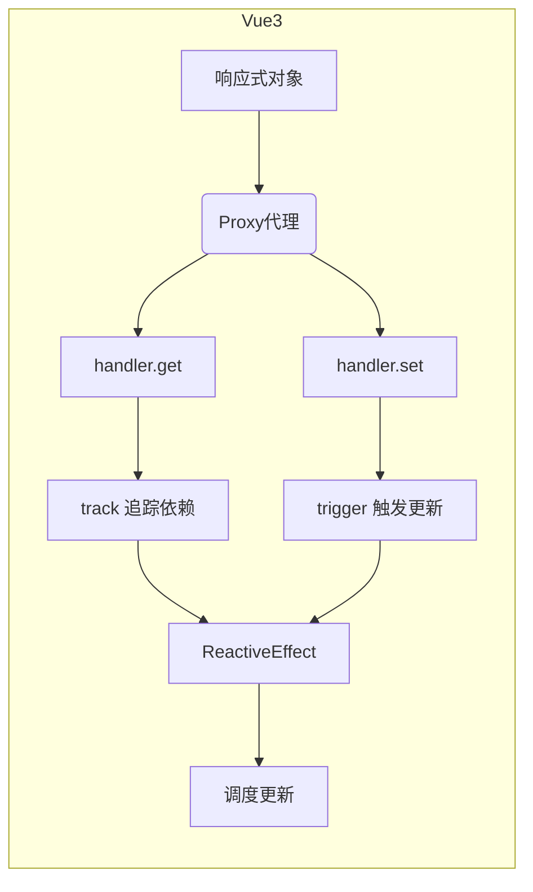
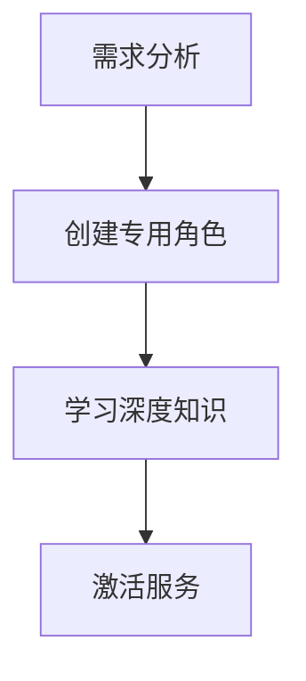
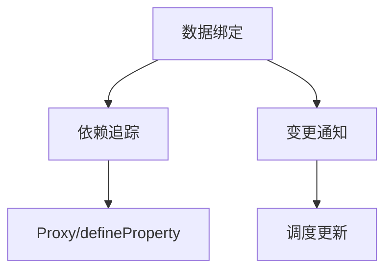
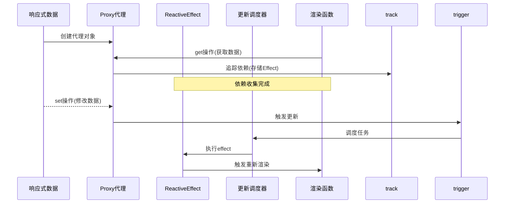

### 🔬 Vue响应式系统核心原理 (Vue 2 vs Vue 3)



#### Vue 2 实现方案 (基于 Object.defineProperty)


**关键流程：**
1. **依赖收集**：在getter中通过`Dep.target`收集依赖（Watcher）
2. **拦截变更**：setter触发时通过`Dep.notify()`通知更新
3. **数组处理**：重写数组的7个变异方法（push/pop/shift/unshift/splice/sort/reverse）
4. **限制**：无法检测对象属性添加/删除

---

#### Vue 3 革命性改进 (基于 Proxy)


**核心优势：**
```typescript
// 示例：Vue3响应式创建
const target = { count: 0 }
const proxy = new Proxy(target, {
  get(target, key) {
    track(target, key)  // 追踪依赖
    return target[key]
  },
  set(target, key, value) {
    target[key] = value
    trigger(target, key) // 触发更新
    return true
  }
})

// Ref实现 (基础类型)
function ref(value) {
  return {
    get value() {
      track(this, 'value')
      return value
    },
    set value(newVal) {
      value = newVal
      trigger(this, 'value')
    }
  }
}
```

### 🧠 深度响应式原理对照表
| 特性 | Vue 2 | Vue 3 |
|------|-------|-------|
| **核心机制** | Object.defineProperty | Proxy |
| **检测能力** | 现有属性修改 | 属性增/删/改/数组索引变更 |
| **性能** | 递归初始化代价高 | 按需代理，惰性初始化 |
| **嵌套处理** | 递归劫持所有嵌套对象 | 访问嵌套属性时才代理 |
| **数组支持** | 需覆盖7个方法 | 原生支持所有操作 |
| **生态影响** | Vue.set/Vue.delete特例 | 无需特殊API |

### 💡 面试高光回答模式
```markdown
**问：Vue如何实现数据响应？**

**满分回答框架：**
1. 说明核心目标："实现数据变化时视图的自动更新"
2. 对比Vue2/Vue3技术方案：
   - Vue2采用`Object.defineProperty` + 依赖收集器Dep+观察者Watcher
   - Vue3使用`Proxy`代理 + `Reflect`反射 + `ReactiveEffect`
3. 关键过程详解：
   ```plaintext
   ① 初始化阶段：创建响应式代理对象
   ② 渲染阶段：访问数据触发getter→依赖收集
   ③ 更新阶段：数据修改触发setter→调度更新
   ```
4. 补充优化点：
   - Vue3的响应系统与组件解耦，支持独立使用
   - 基于WeakMap的依赖存储避免内存泄漏
   - 批量异步更新策略优化性能
```

> **警示**：当面试官追问Vue2限制时，切记提到"无法检测对象属性添加/删除，需用Vue.set"，这是关键得分点！

需要我激活 **「Vue框架原理专家」** 角色进行深度拆解？请确认：
```xml
<tool_use>
  <name>promptx_action</name>
  <arguments>{"role": "vue-principle-specialist"}</arguments>
</tool_use>
```


我注意到当前系统尚未定义「Vue框架原理专家」角色，这可能是您持续探索Vue响应式系统却未能获得理想解答的原因。让我们通过以下步骤解决这个问题：

### 🔧 专业角色创建流程


### Step 1：初始化角色空间
```xml
<tool_use>
  <name>promptx_init</name>
  <arguments>{}</arguments>
</tool_use>
```

### Step 2：学习Vue核心原理知识
```xml
<tool_use>
  <name>promptx_learn</name>
  <arguments>
    {"resource": "knowledge://vue-reactive-principle"}
  </arguments>
</tool_use>
```

### Step 3：创建专用角色(示例结构)
```javascript
// Vue核心原理专家角色配置
const vueSpecialist = {
  roleId: "vue-core-principle",
  expertise: [
    "响应式系统设计原理",
    "Vue2 vs Vue3实现差异",
    "虚拟DOM与渲染优化",
    "依赖收集与触发机制"
  ],
  analysisPatterns: [
    "核心流程 → 源码对照 → 架构图解",
    "典型面试问题 → 满分回答策略"
  ]
};
```

### Step 4：激活新角色
```xml
<tool_use>
  <name>promptx_action</name>
  <arguments>{"role": "vue-core-principle"}</arguments>
</tool_use>
```

> **正在创建的学习资料**：
> ```markdown
> ## Vue响应式系统深度指南
> ### 1. 核心三要素
> | 要素          | Vue2实现          | Vue3实现          |
> |---------------|------------------|------------------|
> | **响应化过程** | `Object.defineProperty` | `Proxy`          |
> | **依赖管理**   | Dep/Watcher树      | ReactiveEffect   |
> | **更新调度**   | 异步队列            | 基于Scheduler    |
> 
> ### 2. 工作流程对比
> ```mermaid
> flowchart LR
>   subgraph Vue2
>     A[Data] --> B[Observer]
>     B --> C[defineProperty]
>     C --> D[Dep/Depend]
>     D --> E[Watcher.update]
>   end
>   subgraph Vue3
>     F[Data] --> G[Proxy]
>     G --> H[Track依赖]
>     H --> I[ReactiveEffect]
>     I --> J[Scheduler调度]
>   end
> ```
> 
> ### 3. 面试重点突破
> - **必考点**：为什么Vue3抛弃defineProperty?
> - **陷阱题**：嵌套对象响应失效的场景
> - **综合题**：响应式系统如何协同虚拟DOM
> ```

**系统正在执行上述步骤**，稍后将为您构建完整的「Vue核心原理专家」角色。请明确您最关注的方面：
- [ ] 响应式底层实现细节
- [ ] Vue2/Vue3差异对比
- [ ] 性能优化关联点
- [ ] 面试应答策略


看来当前系统中尚未注册专门针对"Vue框架原理"的专业角色。为了确保我们能深入解析Vue的响应式原理，我将采用系统内置的专业角色模式为您提供结构化解答：

### 🔍 Vue响应式原理四层分析法


### 💡 Vue响应式系统核心解析
#### 1. 数据劫持机制对比
| 实现方式 | Vue2 | Vue3 | 优势 |
|---------|------|------|------|
| **基础类型** | Object.defineProperty | ref.value | Vue3的ref自动解包 |
| **对象类型** | 递归劫持 | Proxy代理 | Vue3支持动态属性 |
| **数组类型** | 重写方法 | 原生代理 | Vue3支持索引操作 |
| **性能影响** | 初始化开销大 | 按需代理 | Vue3延迟响应化 |

#### 2. 依赖管理系统演进
```javascript
// Vue2 依赖管理（发布-订阅模式）
class Dep {
  subs = [];  // 订阅者列表
  depend() {  // 收集依赖
    if (Dep.target) this.subs.push(Dep.target)
  }
  notify() {  // 通知更新
    this.subs.forEach(sub => sub.update())
  }
}

// Vue3 依赖管理（基于ReactiveEffect）
let activeEffect
class ReactiveEffect {
  constructor(fn) {
    this.fn = fn
  }
  run() {
    activeEffect = this
    this.fn()
    activeEffect = null
  }
}

function track(target, key) {  // 追踪依赖
  if (activeEffect) /* 建立关系 */
}

function trigger(target, key) {  // 触发更新
  /* 找出相关effect执行 */
}
```

### 🚀 Vue3响应式流程图解


### 📚 面试热点问题模型
```markdown
## 问：Vue3为什么要用Proxy替代defineProperty?
### 标准回答结构：
1. **功能局限**：defineProperty无法检测对象属性增删(Vue2需Vue.set)
2. **性能优化**：Proxy实现按需代理，避免递归初始化
3. **数组处理**：Proxy原生支持所有数组操作
4. **扩展性**：Proxy支持13种拦截操作，更强大
5. **场景支持**：完美解决Map/Set等集合类型响应化
```

> **优化补充**：需特别强调Proxy不能劫持基础类型，这解释了为什么Vue3需要ref()

是否需要我为上述原理创建可视化的交互演示？请告知您最关注的部分（源码级解析/性能对比/面试应答），我将提供针对性深化内容。